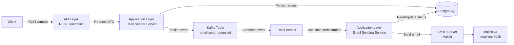
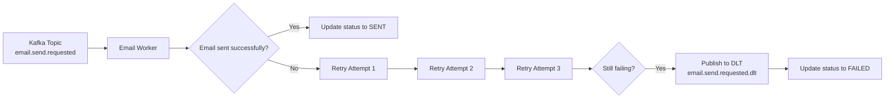
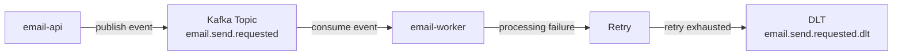
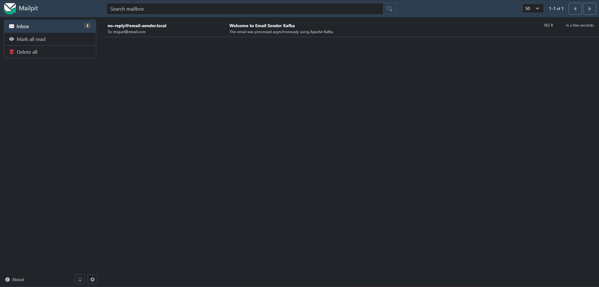

## 📨 Email Sender Kafka


[](LICENSE)


## ✨ Overview

Asynchronous email sending API built with Spring Boot and Apache Kafka.

The main goal of this project is to demonstrate asynchronous communication using Kafka, email request persistence, and event-driven architecture concepts.


> **Project Status:** In development 🚧 — contributions, issues and pull requests are welcome.

&nbsp;&nbsp;&nbsp;


## 🏗️ Architecture

The project follows a layered architecture to separate responsibilities and keep the codebase easier to maintain and test.

- **API layer**: exposes REST endpoints and handles request/response DTOs.
- **Application layer**: contains business services and use case orchestration.
- **Domain layer**: contains entities and domain enums.
- **Infrastructure layer**: contains Kafka, configuration, exception handling and external integrations.

### Main flow:


&nbsp;&nbsp;&nbsp;


## 📂 Project Structure


```text
email-sender-kafka/
├── email-api/
├── email-worker/
├── docker-compose.yml
└── README.md
```
&nbsp;&nbsp;&nbsp;


## 🔁 Retry and DLT

The worker uses Kafka retry and Dead Letter Topic (DLT) mechanisms to improve reliability during temporary failures such as SMTP connection issues.

When email processing fails, the consumer retries the operation before considering the message permanently failed.

### Retry Configuration

| Setting          | Value     |
|------------------|-----------|
| Retry interval   | 2 seconds |
| Max retries      | 3         |
| Total attempts   | 4         |

### Failure Flow:



Messages published to the DLT are kept for later inspection or manual reprocessing.

&nbsp;&nbsp;&nbsp;


## 🗃️ Data Model

The current data model is intentionally simple. The system stores email sending requests in a single table called `email_requests`.

| Field              | Description                              |
|--------------------|------------------------------------------|
| `email_request_id` | Unique identifier of the email request   |
| `recipient`        | Email recipient address                  |
| `subject`          | Email subject                            |
| `body`             | Email content                            |
| `status`           | Current processing status                |
| `attempts`         | Number of processing attempts            |
| `error_message`    | Last error message, if processing fails  |
| `created_at`       | Request creation timestamp               |
| `updated_at`       | Last update timestamp                    |
| `sent_at`          | Timestamp when the email was sent        |

&nbsp;&nbsp;&nbsp;


## 📌 Email Request Status

| Status         | Description                                      |
| -------------- | ------------------------------------------------ |
| PENDING        | Email request created and waiting for processing |
| PUBLISH_FAILED | Failed to publish event to Kafka                 |
| PROCESSING     | Email is being processed by the worker           |
| SENT           | Email successfully sent                          |
| FAILED         | Error while sending email after processing       |

&nbsp;&nbsp;&nbsp;


## ✨ Current Features

- Create asynchronous email requests
- Persist email requests into PostgreSQL
- Publish events to Kafka
- Consume Kafka events using a worker service
- Send emails through Mailpit SMTP server
- Track email processing status
- Handle Kafka publishing failures
- Retry failed email processing attempts
- Publish failed messages to a Dead Letter Topic

&nbsp;&nbsp;&nbsp;


## 🐳 Local Infrastructure

The project uses Docker Compose to run:

- PostgreSQL
- Apache Kafka
- Kafka UI
- Mailpit

&nbsp;&nbsp;&nbsp;


## 🚀 Running the Project

### 1. Clone the repository

```bash
git clone https://github.com/your-username/email-sender-kafka.git
```

### 2. Configure environment variables

Create a `.env` file at the project root:

```env
LOCAL_POSTGRES_DB=email_sender
LOCAL_POSTGRES_DB_USER=postgres
LOCAL_POSTGRES_DB_PASSWORD=postgres
```

### 3. Start containers

```bash
docker compose up -d
```

### 4. Run the application

Start the `email-api` module.

&nbsp;&nbsp;&nbsp;


## 🌐 API Endpoints

| Method |   Endpoint    |             Description              |
|--------|---------------|--------------------------------------|
| `POST` | `/emails`     | Create an asynchronous email request |
| `GET`  | `/emails/{id}`| Get email request status             |

&nbsp;&nbsp;&nbsp;
### POST `/emails`

Creates a new email request and publishes an event to Kafka.

**Request body**

```json
{
  "emailRequestId": "uuid",
  "status": "PENDING"
}
```

Response `202 Accepted`

```json
{
  "recipient": "user@email.com",
  "subject": "Hello",
  "body": "Testing Kafka"
}
```

&nbsp;&nbsp;&nbsp;
### GET `/emails/{id}`

Returns the current status of an email request.

Response `200 OK`

```json
{
  "emailRequestId": "uuid",
  "recipient": "user@email.com",
  "subject": "Hello",
  "status": "PENDING",
  "attempts": 0,
  "createdAt": "2026-05-25T12:00:00"
}
```

&nbsp;&nbsp;&nbsp;


## 📡 Kafka

Apache Kafka is used as the asynchronous communication layer between the API and the worker service.

The API publishes email processing events, while the worker consumes and processes them independently.

### Topics

| Topic                      | Purpose                                              |
|----------------------------|------------------------------------------------------|
| `email.send.requested`     | Main topic responsible for email processing requests |
| `email.send.requested.dlt` | Dead Letter Topic used after retry exhaustion        |

### Kafka Flow:


&nbsp;&nbsp;&nbsp;


## 📬 Mailpit

Mailpit is used as a local SMTP server for development and testing purposes.

Instead of sending real emails, all outgoing messages are captured locally and can be inspected through the Mailpit web interface.

### Features

- Local SMTP testing
- Email preview UI
- No real email delivery
- Safe development environment

### Mailpit UI

```text
http://localhost:8025
```

### 📷 Preview

<p></p>


## 📈 Next Steps

- Automated tests
- Metrics and observability
- Dockerization improvements
- Manual email reprocessing endpoint
